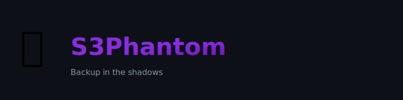

<!-- HEADER BANNER -->
<p align="center">
  
</p>

<h1 align="center">S3Phantom</h1>

<p align="center">
  <b>Backup in the shadows. Stay invisible. Stay safe.</b>
</p>

<p align="center">
  <picture>
    <source media="(prefers-color-scheme: dark)" srcset="assets/banner-dark.svg">
    <source media="(prefers-color-scheme: light)" srcset="assets/banner-light.svg">
    
  </picture>
</p>
---

<p align="center">
  
  
  
  
  
</p>

---

## 👻 What is S3Phantom?

**S3Phantom** is a lightweight, secure, and **rootless** Docker utility designed to silently bridge a live S3 bucket and an encrypted, versioned backup repository.

It combines:

* **rclone** → fast S3 ingestion
* **restic** → encrypted, deduplicated snapshots

---

## ⚡ Features

* 🕶️ Stealth S3 → S3 pipeline
* 🔐 Client-side encryption
* 👤 Rootless execution
* ♻️ Snapshot retention & pruning
* ⚙️ Fully environment-driven
* 🌍 Works with any S3-compatible provider

---

## 🧠 How it works

```text
[SOURCE S3]
     │
     ▼
  rclone sync
     │
     ▼
 [local staging]
     │
     ▼
 restic backup
     │
     ▼
[ENCRYPTED S3 REPO]
```

---

## 🚀 Quick Start

### Build

```bash
docker build -t s3phantom .
```

### Run

```bash
docker run --rm \
  -e RESTIC_REPOSITORY="s3:https://s3.amazonaws.com/my-backup-bucket" \
  -e RESTIC_PASSWORD="supersecret" \
  -e AWS_ACCESS_KEY_ID="DEST_KEY" \
  -e AWS_SECRET_ACCESS_KEY="DEST_SECRET" \
  -e SRC_S3_BUCKET="source-bucket" \
  -e SRC_S3_ENDPOINT="https://s3.eu-central-1.amazonaws.com" \
  -e SRC_S3_ACCESS_KEY="SRC_KEY" \
  -e SRC_S3_SECRET_ACCESS_KEY="SRC_SECRET" \
  -e KEEP_LAST=7 \
  -v /mnt/staging:/data \
  s3phantom
```

---

## ⚙️ Configuration

### 🔐 Destination

| Variable              | Description         |
| --------------------- | ------------------- |
| RESTIC_REPOSITORY     | Destination S3 repo |
| RESTIC_PASSWORD       | Encryption password |
| AWS_ACCESS_KEY_ID     | Access key          |
| AWS_SECRET_ACCESS_KEY | Secret key          |

---

### 📥 Source

| Variable                 | Description   |
| ------------------------ | ------------- |
| SRC_S3_BUCKET            | Source bucket |
| SRC_S3_ENDPOINT          | Endpoint      |
| SRC_S3_ACCESS_KEY        | Access key    |
| SRC_S3_SECRET_ACCESS_KEY | Secret        |
| SRC_S3_REGION            | Region        |

---

### ⚙️ Optional

| Variable    | Description       | Default  |
| ----------- | ----------------- | -------- |
| KEEP_LAST   | Snapshots to keep | Disabled |
| SOURCE_PATH | Local path        | /data    |
| DRY_RUN     | Simulation mode   | false    |

---

## 🧩 Docker Compose

```yaml
version: "3.8"

services:
  s3phantom:
    image: s3phantom
    environment:
      RESTIC_REPOSITORY: s3:https://s3.amazonaws.com/my-backup-bucket
      RESTIC_PASSWORD: supersecret
      AWS_ACCESS_KEY_ID: DEST_KEY
      AWS_SECRET_ACCESS_KEY: DEST_SECRET
      SRC_S3_BUCKET: source-bucket
      SRC_S3_ENDPOINT: https://s3.eu-central-1.amazonaws.com
      SRC_S3_ACCESS_KEY: SRC_KEY
      SRC_S3_SECRET_ACCESS_KEY: SRC_SECRET
      KEEP_LAST: 7
    volumes:
      - /mnt/staging:/data
```

---

## 🕶️ Philosophy

> Your data moves in silence.
> Your backups live forever.
> **S3Phantom watches from the shadows.**

---

## 📜 License

MIT

